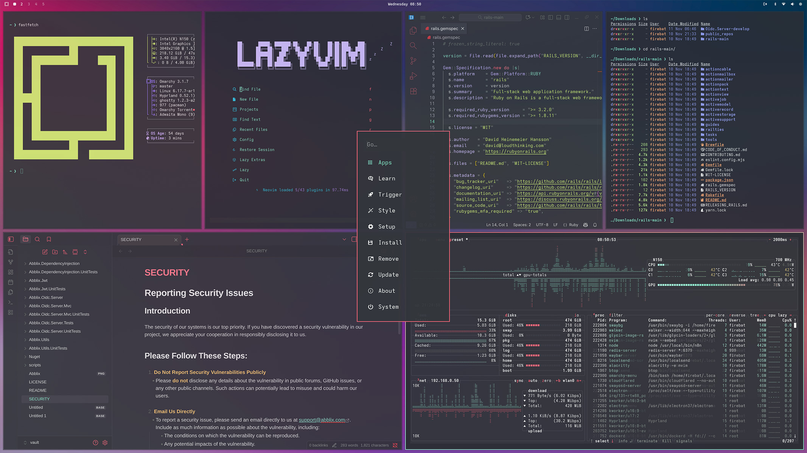

# Planetz Roller Theme



**Planetz Roller** is a colorful, soft-toned theme with a flat, painted look across the entire interface. The name comes from the [_Planetz Big Swig Roller_](https://splatoonwiki.org/wiki/Planetz_Big_Swig_Roller), a roller-type weapon in Splatoon 3.


## Install

```sh
omarchy-theme-install https://github.com/monoooki/omarchy-planetz-roller-theme
```

Companion themes for other editors are also available:

- VS Code: https://github.com/monoooki/vscode-planetz-roller-theme
- Obsidian: https://github.com/monoooki/obsidian-planetz-roller-theme

## License

Released under the MIT license.

Wallpaper imagery is licensed via the [Unsplash License](https://unsplash.com/license) and uses photos by
[Aedrian Salazar](https://unsplash.com/photos/03r2PBffuCk),
[Luca Nicoletti](https://unsplash.com/photos/fkA-hGDs-Y8),
[Bruno Figueiredo](https://unsplash.com/photos/uoteo7uO5OI),
[Murat Onder](https://unsplash.com/photos/EWDCeCUz8Ho),
[Marc Newberry](https://unsplash.com/photos/xKnUnPEUiWA),
and [Jahanzeb Ahsan](https://unsplash.com/photos/pVzRwZJPK-M) on Unsplash.


<a href="https://ko-fi.com/monoooki" target="_blank"></a>
